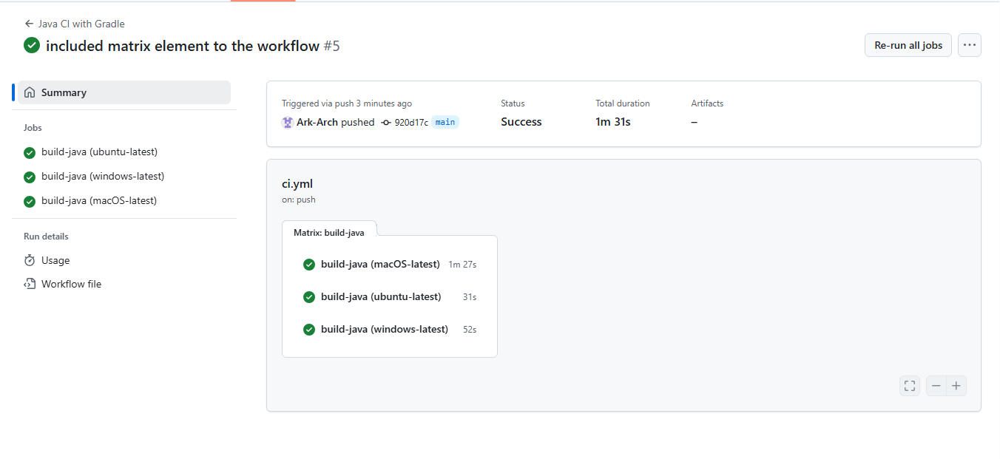
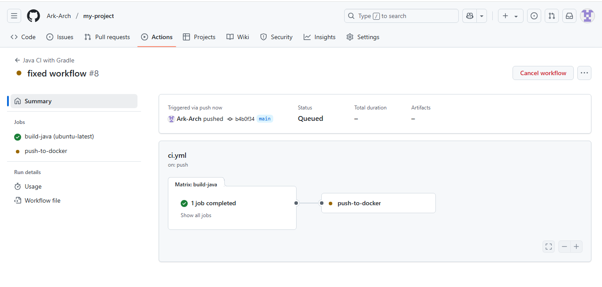

# my-project
learning to use github action for ci/cd with techword with nana

NOTE: CI/CD is only ONE OF the many workflows that could be written in a developer environment. - it involves the automation of the building, testing and deployment of a written application and consequent push request changes.

1. clone nana's Java App with Gradle
2. build docker image 
3. push to private docker repository

using github actions - one could pick a workflow template

*it is important for a ci tool to be able to integrate with different other tools. because different technologies require a combination of so much varying other tools.

name

jobs
    uses -> selects an action (whenever we are dealing with something in the repository.)
    with -> 
    run -> this command is used to write a command-line command

IMPORTANT NOTES:
- WORKFLOWS IN GITHUB ARE MANAGED BY GITHUB SERVERS! - BUT I CAN ALSO HOST MY OWN

- for EVERY SINGLE JOB IN A WORKFLOW, IT RUNS IN A FRESH VIRTUAL ENVIRONMENT

ON JOB RUNS ON A SINGLE SERVER AT A TIME.

SO THERE COULD BE

jobs:
    build:
        ...
    publish:
        needs: build

the above would overide the fact that jobs always run in parrallel!

runs-on: ${{matrix.os}}
strategy:
    matrix
        os: [ubuntu-latest, windows-latest, macOS-latest]

THE ABOVE WOULD HELP TEST/ RUN THE WORKFLOW IN THE THREE AVAILABLE VIRTUAL SERVERS PROVIDED BY GITHUB

THEY WOULD BE EXECUTED IN PARALLEL!

## IMAGE BELOW: SHOWS RESULTS FROM THE SUCCESSFUL WORKFLOW

WITH THE BELOW, YOU CAN WRITE MULTIPLE RUN COMMANDS WITH THE WORKFLOW using the PIPE! (|)
    steps:
      - name: Build and push dockr image
        run: |
          docker login cred
          docker build ...

## THE IMAGE BELOW SHOWS SUCCESSFULL OPERATION OF BOTH JOBS
